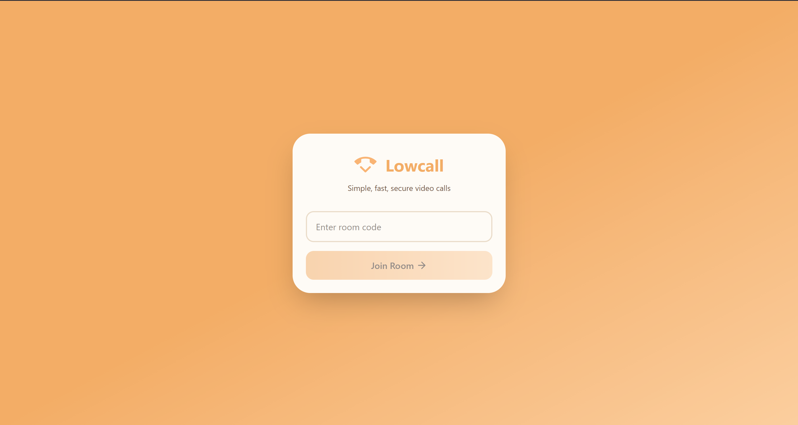
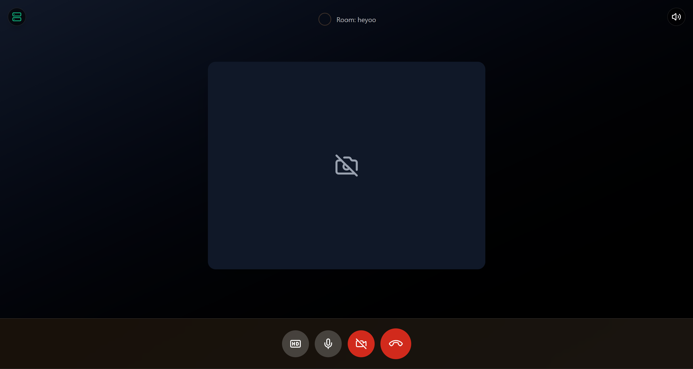
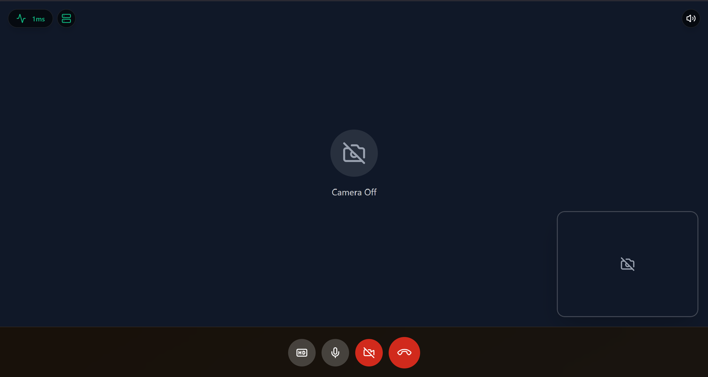
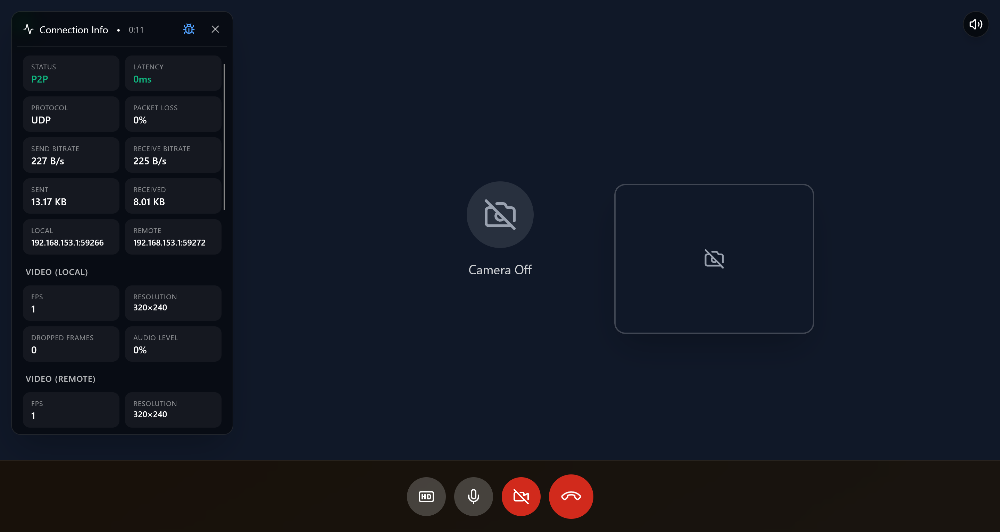

# Lowcall

A lightweight real-time video communication platform built with WebRTC and Socket.io, designed for fast peer-to-peer calling with minimal setup and infrastructure overhead.

## Features

- Instant room creation and joining (no authentication)
- Peer-to-peer video communication using WebRTC
- Socket.io-based signaling layer
- Connection recovery and reconnection handling
- Low-latency responsive UI
- Minimal flow optimized for speed and accessibility
- Self-hosted signaling server

## Screenshots

## Overview

Lowcall is a real-time communication platform focused on simplicity and resilience. It was built around the idea of removing friction from video calling — users can instantly create or join a room without accounts, setup, or extra steps.

The project was also an exploration of WebRTC behavior under unstable network conditions and the challenges of maintaining peer connections in real-world environments.

## Architecture

### WebRTC Peer Layer

Direct peer-to-peer connections handle media streaming, while Socket.io is used only for signaling and room coordination.

### Signaling System

A lightweight WebSocket-based signaling server manages session discovery and peer connection setup.

### Infrastructure

Deployed on Linux with Nginx reverse proxy, SSL configuration, and manual server management.

## Technical Challenges

- Handling unstable peer reconnections in weak networks
- Dealing with inconsistent WebRTC behavior across browsers
- Synchronizing signaling state without race conditions
- Debugging real-time connection failures in production

## Tech Stack

- React
- Vite
- TypeScript
- WebRTC
- Socket.io
- WebSocket
- Tailwind CSS
- Nginx
- Linux
